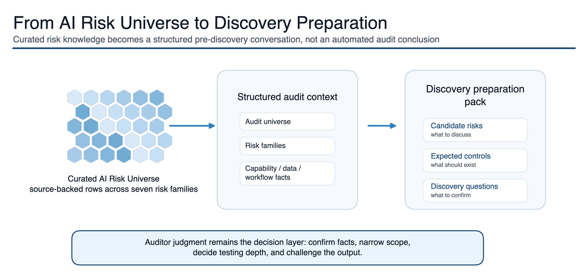
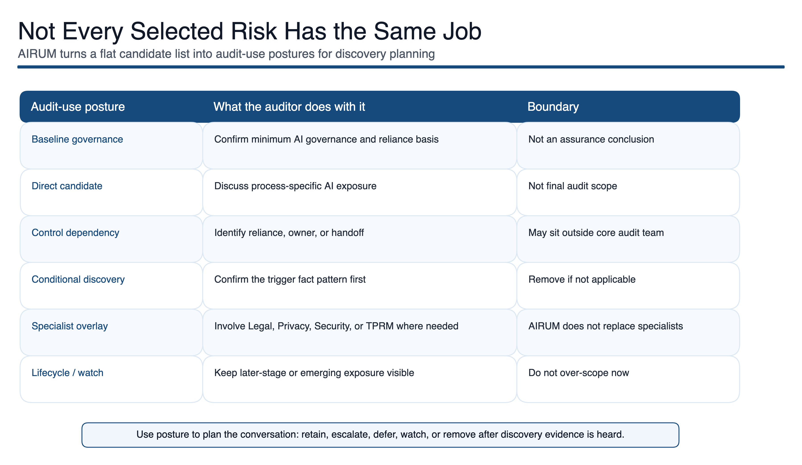

# AIRUM: AI Risk Universe Matrix

AIRUM stands for **AI Risk Universe Matrix**. It is a practitioner-built Internal Audit concept for preparing AI risk discovery before an audit starts.

This public repository is a reduced public introduction to the idea. It explains the method, shows the main visuals, and describes how AIRUM can be used in audit, teaching, and research. It does **not** publish the full working implementation, internal rules, scoring logic, data mappings, private audit material, or the complete methodology package.

## Public links

- AIRUM overview: <https://busera.github.io/AIRUM-public-demo/>
- Explore and select: <https://busera.github.io/AIRUM-public-demo/explore/>
- Sampling methodology: <https://busera.github.io/AIRUM-public-demo/explore/sampling-methodology.html>
- Example export: <https://busera.github.io/AIRUM-public-demo/examples/reduced-discovery-working-paper.html>
- GitHub source - secondary source-code view: <https://github.com/busera/AIRUM-public-demo/tree/main>

## What AIRUM is

AIRUM has two connected purposes.

First, it is a curated AI Risk Universe: a structured collection of source-backed AI risks that auditors can use for exploration, education, methodology development, and risk-based AI audit planning. The internal AIRUM v3.2 working universe contains 67 source-backed AI Risks, 75 consolidated controls, 212 risk-control mappings, additional ISACA AI Audit Toolkit 2024 control-library grounding, and structured risk/control audit procedure planning guidance. It is organized across seven broad families: AI strategy and value management, organization and culture, governance and risk, data management, engineering and lifecycle, security and malicious use, and societal and ethical impact.

Second, it is a deterministic Risk Scoping layer for AI audits. This layer turns structured audit context into a reviewable pre-discovery preparation pack: candidate AI risks, baseline AI governance checks, process-specific considerations, expected controls, discovery questions, lifecycle assumptions, specialist dependencies, and material an auditor can use before the first serious scoping conversation.

The goal is not to automate audit judgment. The goal is to make the first version of the audit conversation stronger, more traceable, and easier to challenge.

## Methodology at a glance

AIRUM was built from a dual-path review of AI risk and control sources.

First, known AI failure modes were identified directly from threat and risk repositories. Where sources explicitly describe issues such as prompt injection, automation bias, data leakage, model inversion, or weak accountability, these were mapped into broader AI Risk families and audit-relevant process areas.

Second, control and governance sources were reviewed in reverse. For standards, maturity models, and management guidance, the question was: "What negative outcome is this control or requirement meant to prevent?" This helped translate expected controls into implied risks, such as missing ownership, weak human oversight, poor lifecycle governance, inadequate validation, or unmanaged third-party AI dependency.

The result is a structured AI Risk Universe designed for audit preparation: broad enough to avoid early blind spots, but organized enough to support discovery questions, expected-control conversations, and scope challenge.

Source families considered include:

- AI management-system and governance standards
- AI maturity and organizational-readiness models
- AI risk repositories and incident-oriented research
- LLM and machine-learning security threat taxonomies
- Industry guidance on AI strategy, governance, trust, risk, and security management

The public demo intentionally shows only a reduced version. It does not publish the full 67-risk data core, full normalized control mappings, source mapping, scoring logic, internal rules, or complete methodology package. The reduced explorer shows visible risk examples, mapped applicable controls, control-level audit procedure guidance, and a separate sampling methodology reference, but it does not provide engagement-specific workpapers, testing conclusions, or sample selections.

## The problem AIRUM addresses

AI risk is difficult for Internal Audit because it can sit inside formal models, vendor platforms, business processes, spreadsheet workflows, research activities, customer-facing tools, or informal productivity shortcuts.

That breadth creates two common scoping failures:

1. The audit team scopes too narrowly and misses how AI is actually being used.
2. The audit team scopes too broadly and arrives at discovery with a generic AI risk list that is too wide to guide a serious conversation.

AIRUM is designed to bridge that gap. It keeps the risk universe broad enough to avoid blind spots, then applies structured scoping so auditors can focus on the risks, controls, questions, and dependencies that are most relevant for the audit context.

## How AIRUM works at a high level

A typical AIRUM preparation flow has four steps:

1. **Start with the audit context.** Define the business process or domain, known or suspected AI use, lifecycle stage, data dependency, vendor involvement, governance maturity, and specialist overlays.
2. **Map to the AI Risk Universe.** Use the curated risk universe to identify candidate AI Risks, expected controls, discovery questions, and dependencies.
3. **Group risks by audit use.** Separate baseline governance topics, direct process risks, specialist dependencies, lifecycle/future-stage considerations, and contextual watch items.
4. **Challenge the output.** The auditor keeps, amends, escalates, defers, or removes risks based on discovery evidence and professional judgment.

## Why deterministic scoping matters

AIRUM's current Risk Scoping approach is deterministic by design. For early audit planning, that matters.

A black-box answer is not very useful if the auditor cannot inspect why a risk appeared. AIRUM should make the rationale visible enough to challenge: whether a risk is a baseline governance topic, a process-specific candidate risk, a specialist dependency, a lifecycle consideration, or a conditional item that depends on what the auditee confirms.

AI and probabilistic methods may later support summarization, enrichment, or adjacent-risk suggestions. They should not replace the audit judgment layer. In the current version, determinism protects traceability and keeps the auditor in control.

## How an auditor would use it

An auditor would use AIRUM before discovery, not after the audit conclusion has already formed.

The preparation pack helps the team walk into the first discussion with better assumptions to test:

- Where is AI used or planned?
- Is the AI internally developed, vendor-provided, embedded in a platform, or informally adopted by users?
- What data is used, and who owns it?
- Which controls are expected to exist before the risk can be managed?
- Which risks are directly in scope, and which are dependencies or specialist topics?
- What should be retained, escalated, deferred, or removed after the auditee explains the actual process?

The value is not that AIRUM produces a final answer. The value is that it reduces ad hoc scoping and makes weak assumptions easier to find.

## Teaching, Internal Audit, and research use

AIRUM can be used as a university or professional education case in IT audit, AI governance, digital trust, risk management, responsible AI, and applied information systems. It is also relevant for Internal Audit organizations that want a more disciplined way to prepare AI risk discovery, challenge scope assumptions, and structure early conversations with auditees.

Possible classroom use:

- Give students a short AI use case.
- Ask them to identify relevant AI risk families.
- Review a candidate risk shortlist.
- Challenge unsupported assumptions.
- Draft discovery questions and expected-control conversations.
- Discuss which topics belong in the audit scope, which require specialist input, and which should remain as dependencies or watch items.

Possible Internal Audit organization use:

- Prepare AI audit discovery sessions with a broader starting risk universe.
- Compare planned scope against baseline governance, process-specific, lifecycle, and specialist-dependency risks.
- Make scoping assumptions more explicit before the first auditee conversation.
- Use the reduced public demo to assess whether a fuller AIRUM-style approach could support audit methodology, training, or commercial collaboration.

Possible research use:

- Compare expert manual scoping with structured AIRUM-supported scoping.
- Test whether risk coverage, rationale quality, and auditor confidence improve.
- Study how AI risks should be mapped to audit-universe processes.
- Evaluate when deterministic methods are preferable to LLM-assisted enrichment.
- Assess whether students or auditors better detect weak evidence after using the case.

## Boundary

AIRUM is a working preparation concept and methodology prototype.

The public demo uses disclosure-safe summaries. It intentionally does not expose AIRUM's internal source captures, local vault paths, licensed-source locators, detailed source-to-control rationale, or private extraction trails. Those internal provenance details may support the private AIRUM working version, but they are not published here and should not be interpreted as public-source-perfect evidence.

It does not:

- decide final audit scope;
- assess control effectiveness;
- calculate residual risk;
- provide legal or compliance conclusions;
- validate that an AI system is safe, fair, secure, compliant, or well governed;
- provide audit assurance;
- verify every source and control rationale end-to-end for public release;
- provide legally validated conclusions;
- provide final audit workpapers ready for use without engagement-specific tailoring.

Those decisions belong to auditors, specialists, management, and governance bodies after the facts are understood.

## Example export

A reduced public selection export is available here:

- [AIRUM example selection export: reduced discovery working paper](examples/reduced-discovery-working-paper.html)

The sample shows how AIRUM can move from broad AI risk coverage to a concrete pre-discovery working paper. It uses a fictional ACME Finance AI-enabled reporting workflow and the same 10 selected example AI Risks as the Explore page. For each selected risk it shows why the risk appears, expected controls, one representative applicable-control summary, an applicable-control audit procedure preview, discovery questions, evidence to request, and retain / escalate / defer / remove fields.

It does not include AIRUM's full rules, scoring logic, source mappings, private audit material, or operational build details.

## Explore and select

The reduced interactive page is available here:

- [AIRUM sample exploration and selection demo](explore/)

It shows two AIRUM purposes clearly:

1. AI Risk Universe exploration with search and family filtering only, without separate Scoping Sector or Scoping AU controls on the main explorer page.
2. Deterministic Risk Scoping for pre-discovery preparation using reduced public demo data.
3. Applicable Control Details pages that show control summary, control sources, Audit Procedure, Test of Design, Test of Effectiveness, and a link to the sampling methodology matrix.

The public demo remains intentionally reduced. It does not publish the full 67-risk data core, normalized control mappings, internal rules, scoring logic, source captures, private mappings, or operational build details.

## Collaboration interest

AIRUM is aimed at three audiences:

- Internal Audit teams looking for a more disciplined way to prepare AI risk discovery.
- Universities and researchers interested in empirical validation of AI risk-to-audit-universe mapping and audit planning methods.
- Event and conference organizers looking for practitioner-led material on AI risk, audit methodology, and digital trust.

## Author

Andre Buser

Views are my own. This repository describes conceptual design patterns and lessons from personal project work. It does not disclose employer or client information, provide legal advice, provide audit assurance, or represent an endorsement by any organization.
